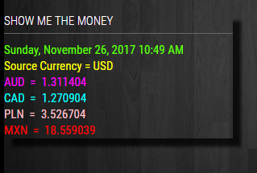
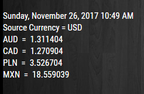

## MMM-LICE

## Live International Currency Exchange

Well, almost live. It's more like hourly with the free API Access Key, but 
MMM-LICE sounded like such a cool name that I couldn't resist.

## What you get

* Real-time JSON API for 168 World Currencies from https://currencylayer.com/

* Exact date and time (UNIX) the exchange rates were collected.

* 1000 free calls per month with free plan

* Annotated .css file included for coloring text and header.

## Examples

One colored example. One default white. Make it your own.

 

## Installation

* `git clone https://github.com/mykle1/MMM-LICE` into the `~/MagicMirror/modules` directory.

* Get your free API Access Key from https://currencylayer.com/ (Free plan)

* No dependencies needed! No kidding!

## Config.js entry and options

    {
        module: 'MMM-LICE',
        position: 'top_left',                   // Best in left, center, or right regions
        config: { 
			accessKey: "Your API Access Key", // Free account & API Access Key at currencylayer.com
			source: "USD",       // The source currency
			x1: "AUD",
			x2: "CAD",
			x3: "PLN",
			x4: "MXN",
			useHeader: false,                 
			header: "Show me the money",
			maxWidth: "400px",
        }
    },
	
